# SmartMeal
## Recipe generation, recipe storage, and nutrient management 

### Contributors

#### Nachuan Wang (December-17th)
As a user, John wants to generate recipes from the ingredients he had on hand.

UI: MainView -> recipeSearchButton -> RecipeSearchView -> IngredientSearchButton -> IngredientSearchView -> text field/AddMoreButto  -> enter ingredients(max 3) -> SearchButton -> ResultView(TBD)
Note: default 1 ingredient, press + button on UI to add more text field for more ingredient
Use case/Interactor: MainMenuView -> RecipeSearchView -> recipeSearchController -> IngredientSearchView -> IngredientSearchInteractor/InputDataBoundary/OutputDataBoundary -> APIController/recipeGenerationFromIngredientAPIController -> result DAO(TBD)
-> Result UI
Interactor: recipe generation button controller -> from ingredients button controller 
      -> text field/add more button controller -> recipeGenerationFromIngredientAPIController -> result UI
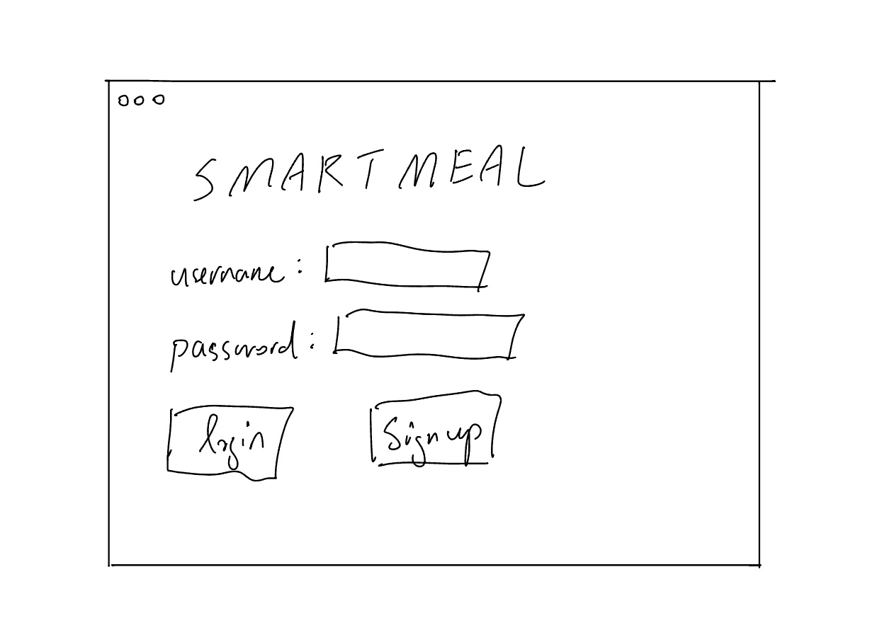
login/signup view
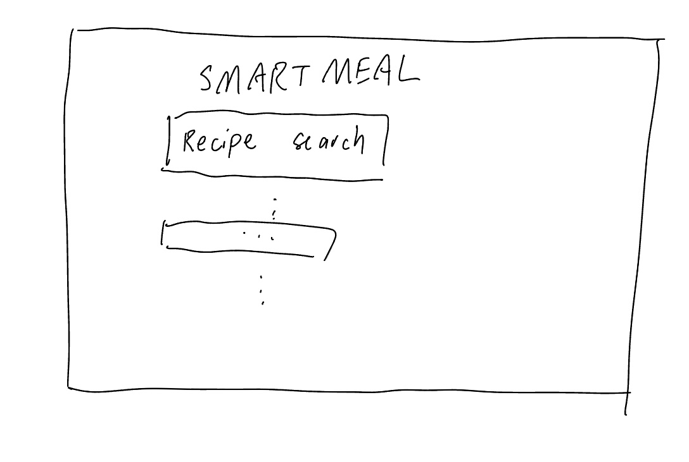
Main menu view
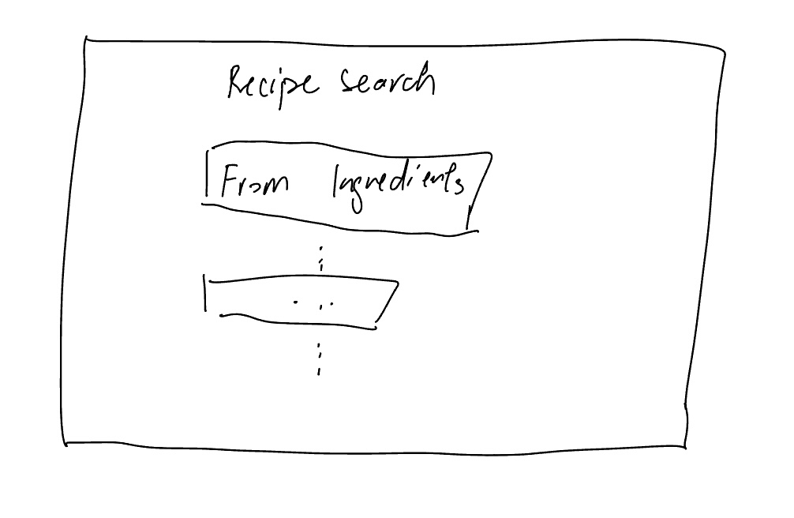
recipe search view
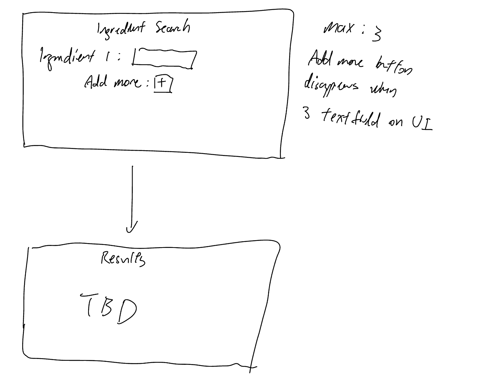
ingredient search view and result view

A demo sketch for the user story and views

#### Azaria Kelman (azariak)
##### User story
As a user, Azaria wants to rank his recipes on a scale of 1 to 5, so that he could remember which recipes he likes. 
He also wants to be able to place them into folders by theme, to create an organized directory.
##### Use Cases
- Each recipe has an attribute of an integer {1, 2, 3, 4, 5}. The user can set the integer by clicking on the respective star.
- Each recipe has a field for its folder. A user can click on a folder button, and type or select the name of the folder it should be included in.
Note: Each Folder is a Class that includes a list of recipes in that folder. Each recipe contains an atrribute for its star rating.

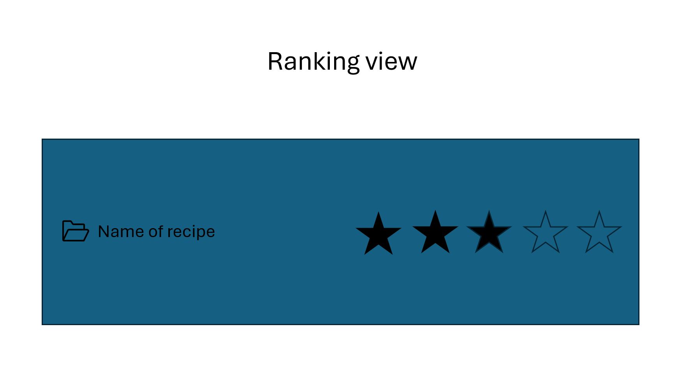
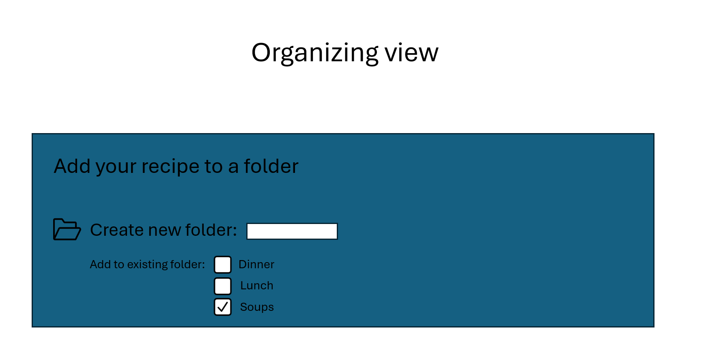

#### Anisa (AHK9)
#### User Story 1
- As a user, Sara wants to save her favorite recipe for later.
#### User Story 2
- As a user Sara wants to reload her previously saved recipes in order to make her favorite
  dish.
#### Use Cases
- The user clicks the saved recipes button and is then redirected to her previously
saved recipes page
- The user clicks on a saved recipe from the list, and the application displays the full recipe details, including 
ingredients, steps, and cooking time.
- The user clicks a delete button on a saved recipe, and the application prompts for 
confirmation before removing the recipe from her saved collection.
- The user clicks a favorite or bookmark icon on a recipe, and the recipe 
is highlighted or added to a "Favorites" section within the saved recipes.
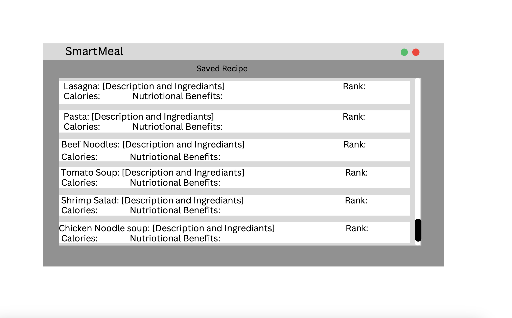

#### Daniel Rafailov (danielrafailov1)
#### User Story
Mia is a user with limited ingredients and/or dietary restrictions. She wants the SmartMeal app to suggest alternative
ingredients for recipes she is interested in, allowing her to make the recipe even when she doesn’t have all the
ingredients on hand.
#### Use Cases
- Mia opens a recipe and sees a list of ingredient substitutions based on her dietary preferences and the ingredients she has.
- If Mia doesn’t have a specific ingredient, she can click on it and view a list of suggested substitutes that match her dietary preferences.
- When Mia selects a substitute ingredient, the recipe automatically updates with the substitution so she can proceed with the adjusted recipe.

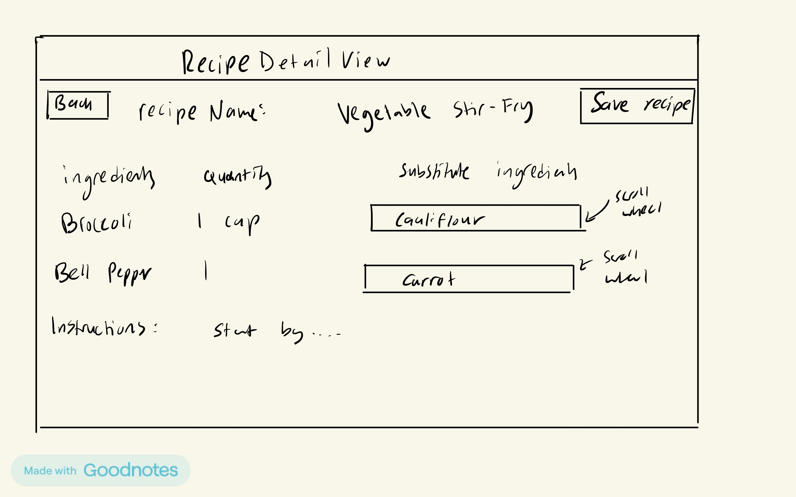
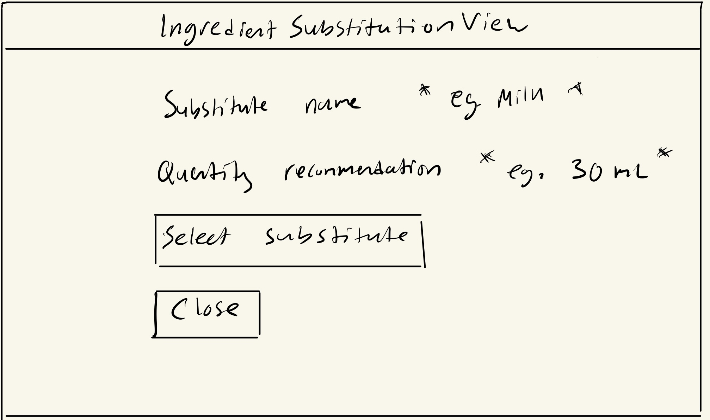

#### Vedavi Anandan (vedavia)
Kathy has allergies and inputs the ingredients she does not want in her meals to generate a list of safe recipes. 

#### Use Cases
- The excluded ingredients are listed in the 'Do not want:' field.
- The search button is clicked to generate a list of recipes.
- The preferred recipes are saved to the users 'git statusSaved Recipes' page by clicking the save button.

Test

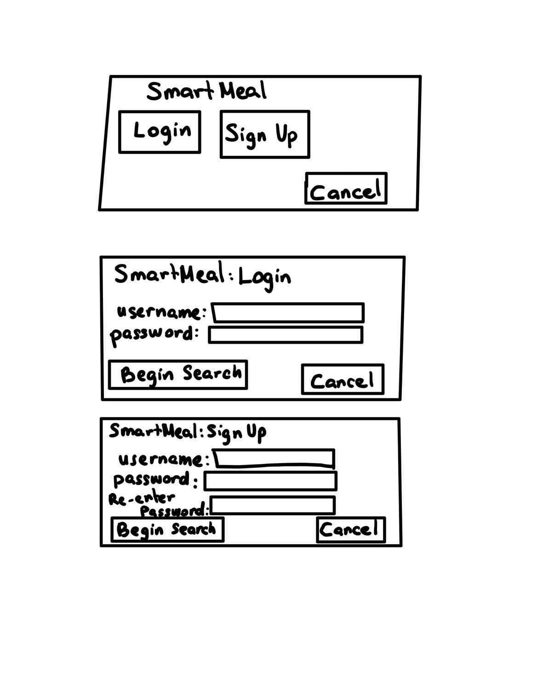
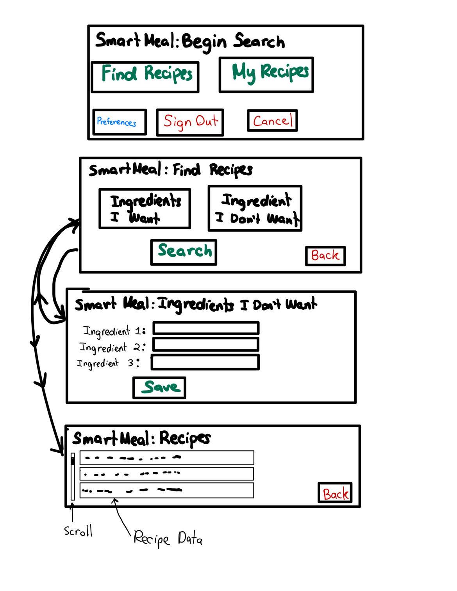
