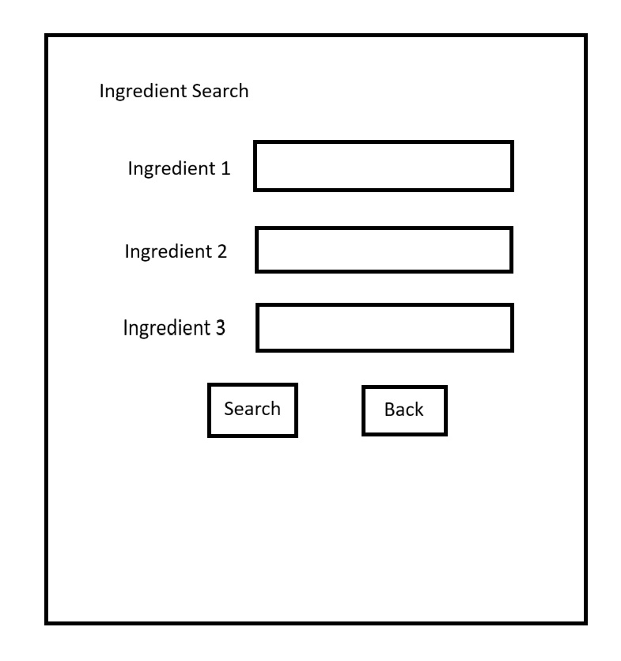
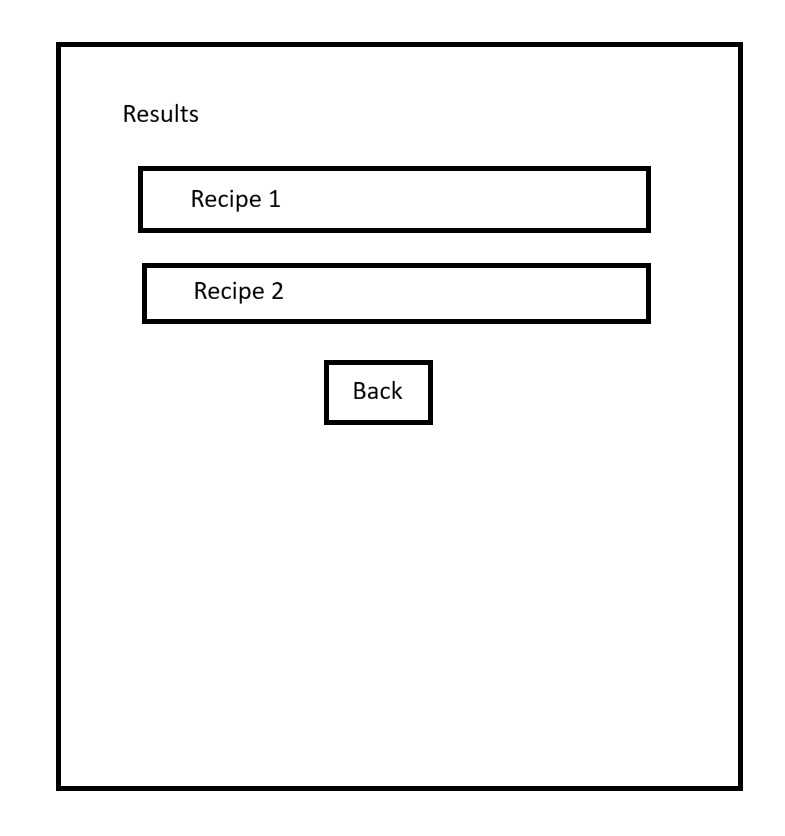
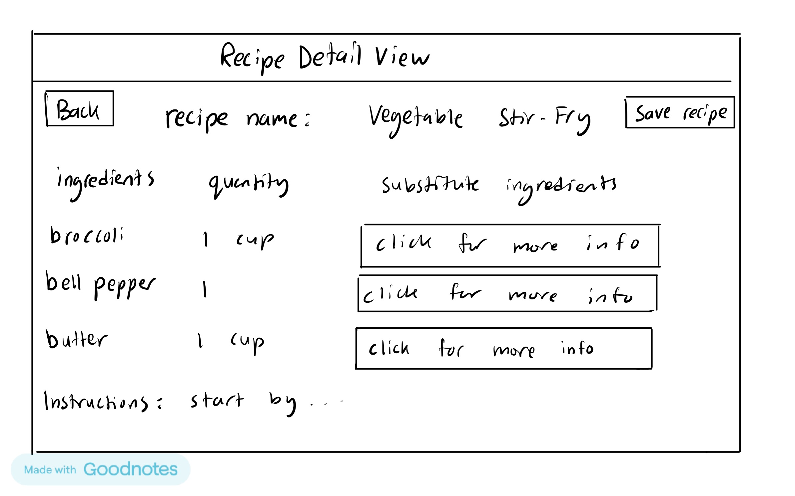
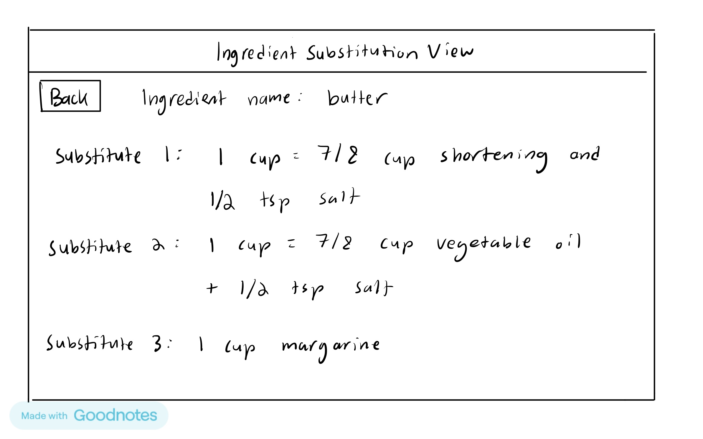

# SmartMeal
## Recipe generation, recipe storage, and nutrient management 

### Table of Contents
- [Title](#smartmeal)
- [Description](#recipe-generation-recipe-storage-and-nutrient-management-)
- [Table of Contents](#table-of-contents)
- [Authors](#authors-)
- [Use Cases (Feature list)](#use-cases)
    - [Nachuan](#nachuan-wang-december-17th)
    - [Azaria](#azaria-kelman-azariak)
    - [Anisa](#anisa-ahk9)
    - [Daniel](#daniel-rafailov-danielrafailov1)
    - [Vedavi](#vedavi-anandan-vedavia)
- [Installation Instructions](#installation-instructions)
- [How to Use](#how-to-use)
- [License](#license)
- [Feedback & Contributions](#feedback--contributions)

### Authors: 
- Anisa (AHK9)
- Azaria Kelman (azariak)
- Daniel Rafailov (danielrafailov1)
- Nachuan Wang (December-17th)
- Vedavi Anandan (vedavia)

TODO:
- [ ] As per Quercus Module, we should include: Title, authors, description. table of contents, feature list,
installation instructions, how to use (with examples), licence, feedback and contributions

### Use Cases

#### Nachuan Wang (December-17th)
As a user, John wants to search for recipes from the ingredients he had on hand.

UI: MainMenuView -> IngredientSearchButton -> IngredientSearchView -> enter ingredients(max 3) -> SearchButton -> ResultView
Use case: MainMenuView -> MainMenuUseCase -> IngredientSearchView -> IngredientSearchUseCase -> 
apiDAO -> ResultView

Ingredient Search view

Result view

#### Azaria Kelman (azariak)
##### User story
As a user, Azaria wants to rank his recipes on a scale of 1 to 5, so that he could remember which recipes he likes.
##### Use Cases
- Each recipe has an attribute of an integer {1, 2, 3, 4, 5}. The user can set the integer by clicking on the respective star.
- Each recipe has a field for its folder. A user can click on a folder button, and type or select the name of the folder it should be included in.
Note: Each Folder is a Class that includes a list of recipes in that folder. Each recipe contains an atrribute for its star rating.

[//]: # (![Organizing_view.jpg]&#40;images/Azaria_User_Story/Organizing_view.png&#41;)

#### Anisa (AHK9)
#### User Story
- As a user Sara wants to save and reload her previously saved recipes in order to make her favorite
  dish.
#### Use Cases
- The user clicks the saved recipes button and is then redirected to her previously
saved recipes page
- The user clicks on a saved recipe from the list, and the application displays the full recipe details, including 
ingredients, steps, and cooking time.
- The user clicks a delete button on a saved recipe, and the application prompts for 
confirmation before removing the recipe from her saved collection.

#### Daniel Rafailov (danielrafailov1)
#### User Story
Mia is a user with limited ingredients. She wants to be able to click on a recipe and view all the relevant details
including alternative ingredient suggestions so that she can adapt the recipe easily and have greater flexibility when 
cooking or baking.

#### Use Cases
- As a user, I want to be able to click on a recipe and view all the relevant details of it
- As a user, I want to be able to see alternative ingredient suggestions for a recipe so that I can use other ingredients
if I don't have the ones mentioned in the recipe

#### Vedavi Anandan (vedavia)
Kathy has allergies and inputs the ingredients she does not want in her meals to generate a list of safe recipes. 

#### Use Cases
- The excluded ingredients are listed in the 'Do not want:' field.
- The search button is clicked to generate a list of recipes.
- The preferred recipes are saved to the users 'git statusSaved Recipes' page by clicking the save button.

Test

### Installation Instructions
- Dependencies:
  - Java
  - ...
### How to Use
  - To open this app, run the `Main` file in `src\main\java\app\Main`. 
  It will preserve information across sections.
  - Once it is open...

### License

### Feedback & Contributions
- To give feedback or contribute, you can open a GitHub issue, or create a pull request.