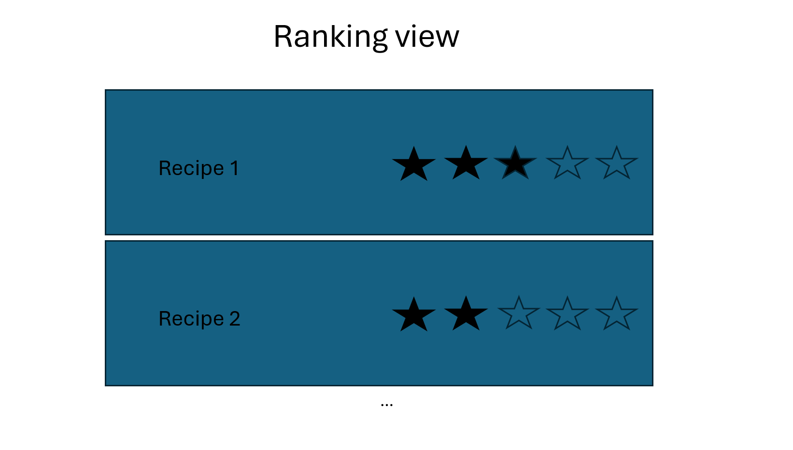

# SmartMeal
## Recipe generation, recipe storage, and recipe ranking 

### Table of Contents
- [Title](#smartmeal)
- [Description](#recipe-generation-recipe-storage-and-nutrient-management-)
- [Table of Contents](#table-of-contents)
- [Authors](#authors-)
- [Use Cases (Feature list)](#use-cases)
    - [Nachuan](#nachuan-wang-december-17th)
    - [Azaria](#azaria-kelman-azariak)
    - [Anisa](#anisa-ahk9)
    - [Daniel](#daniel-rafailov-danielrafailov1)
    - [Vedavi](#vedavi-anandan-vedavia)
- [Installation Instructions](#installation-instructions)
- [How to Use](#how-to-use)
- [License](#license)
- [Feedback & Contributions](#feedback--contributions)

### Authors: 
- Anisa (AHK9)
- Azaria Kelman (azariak)
- Daniel Rafailov (danielrafailov1)
- Nachuan Wang (December-17th)
- Vedavi Anandan (vedavia)

### Use Cases

#### Nachuan Wang (December-17th)
As a user, John wants to search for recipes from the ingredients he had on hand.

UI: MainMenuView -> IngredientSearchButton -> IngredientSearchView -> enter ingredients(max 3) -> SearchButton -> ResultView
Use case: MainMenuView -> MainMenuUseCase -> IngredientSearchView -> IngredientSearchUseCase -> 
apiDAO -> ResultView

Ingredient Search view

Result view

#### Azaria Kelman (azariak)
##### User story
As a user, Azaria wants to rank his recipes on a scale of 1 to 5, so that he could remember which recipes he likes.
##### Use Cases
- A user clicks on `Ranked Recipes` to see recipes they've ranked
- A user clicks `Edit Ranking`. Each recipe has an attribute of an integer {1, 2, 3, 4, 5}. The user can change the ranking by clicking on the respective star.

[//]: # (![Organizing_view.jpg]&#40;images/Azaria_User_Story/Organizing_view.png&#41;)

#### Anisa (AHK9)
#### User Story
- As a user Sara wants to save and reload her previously saved recipes in order to make her favorite
  dish.
#### Use Cases
- The user clicks the saved recipes button and is then redirected to her previously
saved recipes page
- The user clicks on a saved recipe from the list, and the application displays the full recipe details, including 
ingredients, steps, and cooking time.
- The user clicks a delete button on a saved recipe, and the application prompts for 
confirmation before removing the recipe from her saved collection.

#### Daniel Rafailov (danielrafailov1)
#### User Story
Mia is a user with limited ingredients. She wants to be able to click on a recipe and view all the relevant details
including alternative ingredient suggestions so that she can adapt the recipe easily and have greater flexibility when 
cooking or baking.

#### Use Cases
- As a user, I want to be able to click on a recipe and view all the relevant details of it
- As a user, I want to be able to see alternative ingredient suggestions for a recipe so that I can use other ingredients
if I don't have the ones mentioned in the recipe

#### Vedavi Anandan (vedavia)
Kathy wants to try a recipe, but has no idea which ingredients to buy at the store as there are many
options. She opens up the recipe detail view and clicks on the Grocery List button to generate a list
of possible grocery items she can choose from to get ingredients for the recipe.

#### Use Cases
- Click on the Grocery List button in the recipe detail view of any recipe. A view will open up with
  the grocery list.
- Press the back button to return to the recipe detail screen.
[grocery button.pdf](images%2FVedavi_User_Story%2Fgrocery%20button.pdf)
### Installation Instructions
- Dependencies:
  - Java
  - IntelliJ
  - Functioning Spoonacular API keys in environmental variables
  - This should be formatted in IntelliJ as follows:
  - `API_KEY1=...;API_KEY2=...;`
  - Adding multiple API Keys will allow the program to automatically switch to the first that returns a proper output
### How to Use
  - To open this app, run the `Main` file in `src\main\java\app\Main`. 
  It will preserve information across sections
  - Once it is open you must create an account and log in, using the provided buttons
  - Then there are buttons for each User Story
    - To use the ranking feature, a logged-in user clicks `Recipe Rankings` to view rankings. They click `Edit Rankings` and then click on the stars to change a ranking.

### License on GitHub

### Feedback & Contributions
- To give feedback or contribute, you can open a GitHub issue, or create a pull request.